<script type="text/javascript" src="http://cdn.mathjax.org/mathjax/latest/MathJax.js?config=TeX-AMS-MML_HTMLorMML"></script>
<script type="text/x-mathjax-config">
  MathJax.Hub.Config({
    tex2jax: {inlineMath: [['$', '$']]},
    messageStyle: "none",
    "HTML-CSS": { availableFonts: "TeX", preferredFont: "TeX" },
  });
</script>

# SOI1010 Machine Learning II - Assignment #2

Due: November 8, 2023 11:59 pm  
2022094093 Kim Dohoon, Dept. of Data Science  
Colab Link :  
2-1 : https://drive.google.com/file/d/13SveWhWsVaw-yWssm3IHYZZZOVJ6VmyQ/view?usp=sharing  
2-2 : https://drive.google.com/file/d/1acbVP6YUXMSQ4M4vbJ1NCozDZwKQlWZT/view?usp=sharing  

Github Link :  
2-1 : https://github.com/kdh-yu/ML2/blob/main/Assignment/Assignment%232/Assignment2_1.ipynb  
2-2 : https://github.com/kdh-yu/ML2/blob/main/Assignment/Assignment%232/Assignment2_2.ipynb


## Problem #1: Binary Classification via soft-margin SVM on CIFAR10

### a) Load CIFAR10 dataset as follows:
```python
import numpy as np
import torch
from torch import nn
from torch.utils.data import random_split, DataLoader
from torch.autograd import Variable
from torchvision import transforms, datasets
import matplotlib.pyplot as plt
import numpy as np

trainset = datasets.CIFAR10(root='./data', train=True,
                            download=True, transform=transforms.ToTensor())
testset = datasets.CIFAR10(root='./data', train=False, 
                           download=True, transform=transforms.ToTensor())
```

Successfully loaded CIFAR10 dataset.  

<div class="page">

### b) Visualize at least one image for each class. You may need to look into how dataset is implemented in PyTorch.

I plotted 5 images for each class.  
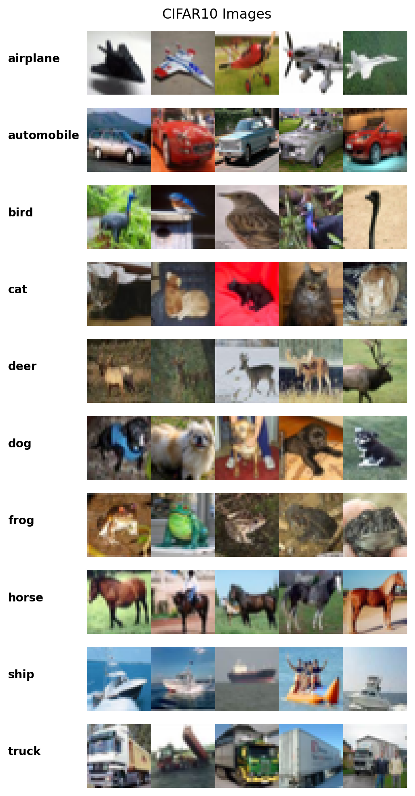

<div class="page">

### c) Split the trainset into training set and validation set with 90% : 10% ratio. Implement dataloaders for CIFAR10.

I splitted dataset, using ```torch.utils.data.random_split``` function.
```
Train Data : 45000
Valid Data : 5000

Shape of X [N, C, H, W]: torch.Size([64, 3, 32, 32])
Shape of y: torch.Size([64]), torch.int64
```

### d) Choose any two classes. Then, make a SVM classifier (implement a loss function yourself. Do not use PyTorch implementations of loss functions.) and its training/validation/evaluation code to perform binary classification between those two classes.

I chose index 3 and 5, which is cat and dog each. They are quite similar, so the accuracy is significantly low when it comes to binary classification.
```
class A : cat
class B : dog

9007 data in train
993 data in valid
```
... and inheriting ```nn.Module```, my SVM classifier was this.
```
SVM(
  (func): Linear(in_features=3072, out_features=1, bias=True)
)
```
3072 for 32 $\times$ 32 pixel for RGB channel(3).  

<div class="page">

### e) Train for 10 epochs with batch size 64.


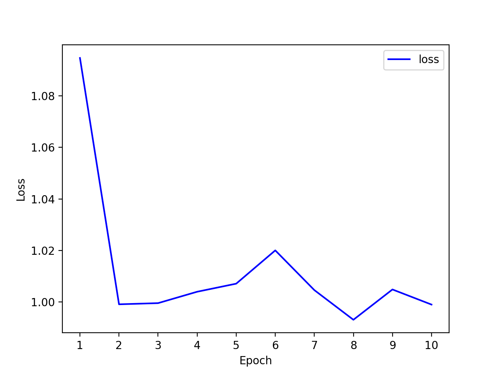

And the model performance at validation set was below.
```
Accuracy : 53.88%
Average Loss : 1.00301
```

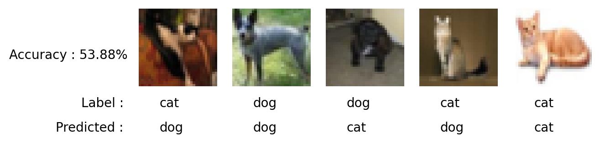  

<div class="page">

### f) Perform data normalization. You may need to look into how to use datasets in PyTorch.
Referring PyTorch Tutorial (https://tutorials.pytorch.kr/beginner/blitz/cifar10_tutorial.html), I could normalize data at data loading step.
```python
transform = transforms.Compose(
    [transforms.ToTensor(),
     transforms.Normalize((0.5, 0.5, 0.5), (0.5, 0.5, 0.5))])
```

### g) Again, train for 10 epochs with batch size 64 after data normalization. Write down your observations.

Using same method, I trained SVM model.  

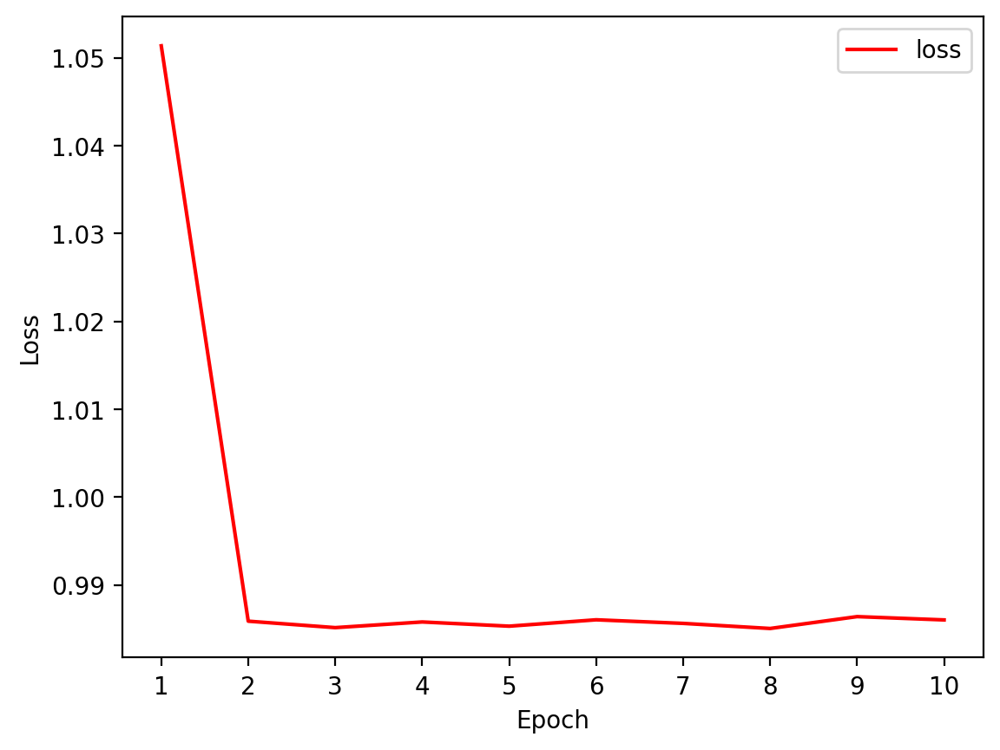  

And the model performance at validation set was below.
```
Accuracy : 56.52%
Average Loss : 0.97218
```

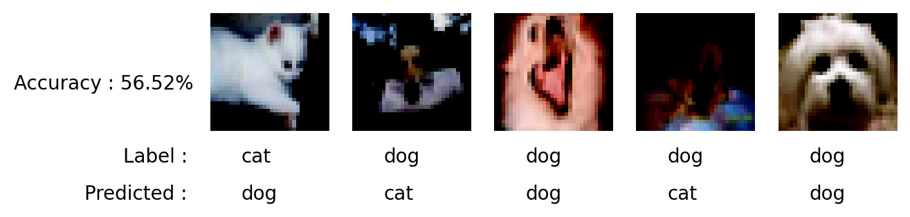

<div class='page'>

> Comparison  

When comparing performances for two datasets, convergence speed of loss was similar, but the model with normalized data got less loss. Amount of trembling of loss was smaller in normalized dataset.
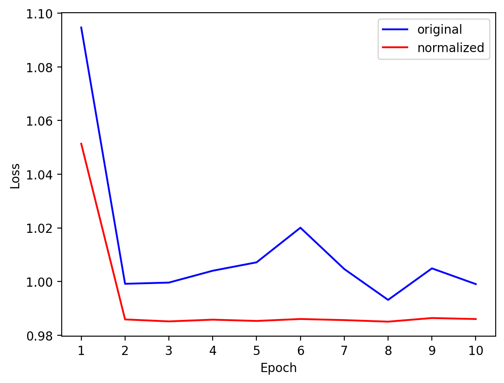

Also the normalized dataset was better.
```bash
# Original
Accuracy : 53.88%
Average Loss : 1.00301

# Normalized
Accuracy : 56.52%
Average Loss : 0.97218
```

### h) What are the hyperparameters you can tune?  

These are main hyperparameters we can tune.

```Batch Size```  
This means how many data will be used at once. I set it 64.  
```Learning Rate```  
This means how fast parameter will be tuned. I set it 0.001.
```Epochs```  
This means how many times model will train. Default is 10 in this code.  
```gamma```  
For SVM, it means how many wrong sample model will allow. Default is 1.0 in this case.  

<div class='page'>

### i) Try to obtain find optimal hyperparameters.  
What I will not change?
- Loss Function : Adam
  - Adam optimizer is a good default choice in many cases.
- Batch size

With fixing them, I will change epochs, gamma, learning rate.

I tried Grid Search to find optimal hyperparameters.  
Because grid search takes long time, I tested for several options.  
```python
# Took about 28 minutes
lr_list = [0.0001, 0.001, 0.01, 0.1]
gamma_list = [0.1, 1.0, 10, 20]
epoch_list = [5, 10, 20, 50, 100]
```

Maximum accuracy was __62.1302__ at this point; learning rate=0.0001, gamma=10, epoch=50, with loss 0.8951... 

Minimum loss was __0.87505...__ at this point; learning rate=0.0001, gamma=10, epoch=20, with accuracy 61.5385.

Because there was no significant difference in terms of loss, I chose the maximum accuracy point.

<div class='page'>

### j) What is the final *test* accuracy?
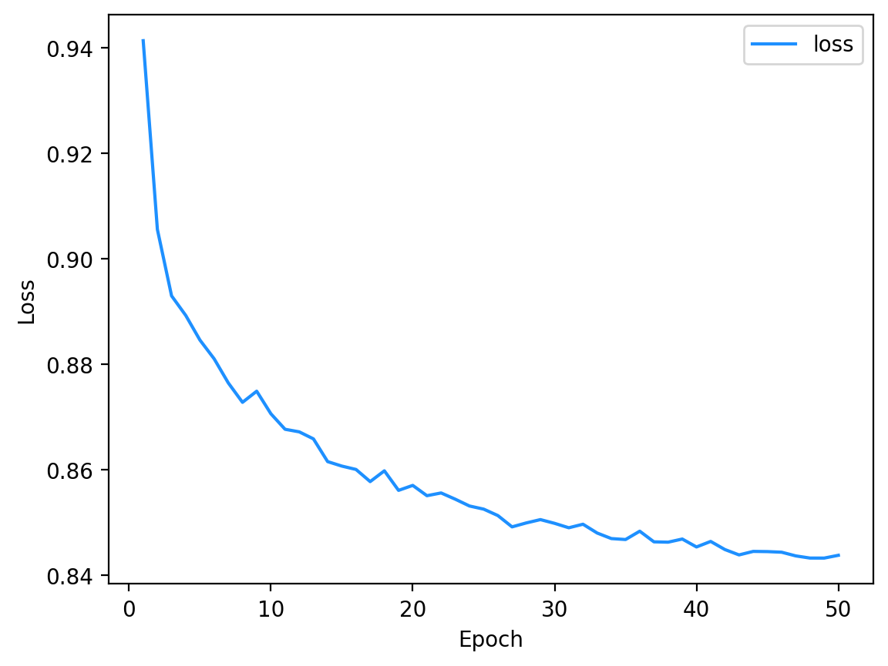  

```
Accuracy : 62.90%
Average Loss : 0.86663
```
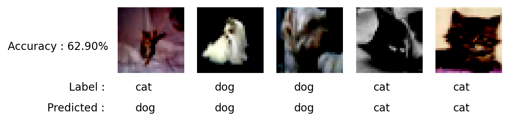

<div class='page'>

## Problem #2 [Bonus/Optional]: Multiclass Classification via soft-margin SVM on CIFAR10

### a) Perform multiclass classification using soft-margin SVM on the whole dataset.  
To perform multiclass classification, model is changed.

- Output of model is changed from 1 to 10.
  - There are 10 classes.
- CrossEntropy as Loss funcion.
  - After applying softmax to model output, cross entropy is used.

Initially, hyperparameters are set as same above. Learning rate = 0.001, batch size = 64, epochs = 10, gamma = 1.0. And model performance is this.

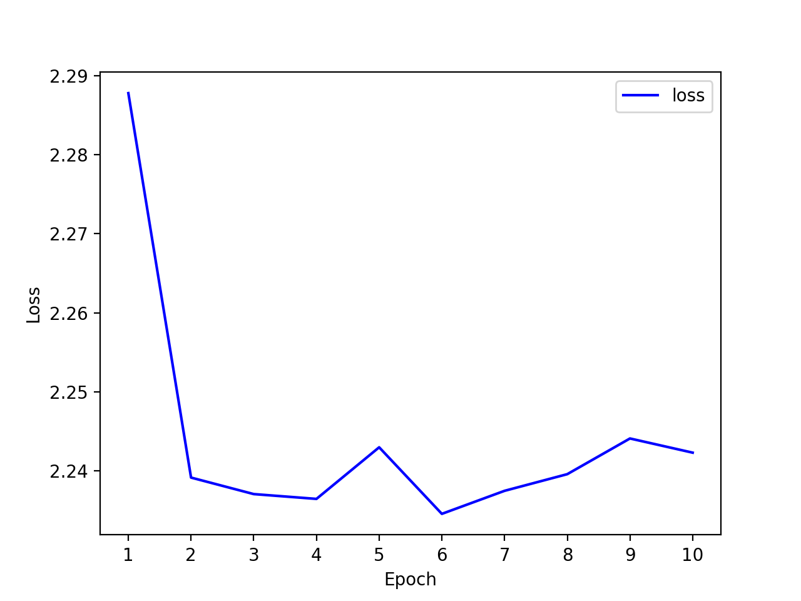  

<div class='page'>

```
Accuracy for class: airplane   is 33.27% (164/493)
Accuracy for class: automobile is 40.43% (205/507)
Accuracy for class: bird       is 14.75% ( 73/495)
Accuracy for class: cat        is 8.02% ( 39/486)
Accuracy for class: deer       is 38.62% (202/523)
Accuracy for class: dog        is 34.48% (170/493)
Accuracy for class: frog       is 12.40% ( 65/524)
Accuracy for class: horse      is 23.88% (107/448)
Accuracy for class: ship       is 69.92% (358/512)
Accuracy for class: truck      is 18.69% ( 97/519)

Total Accuracy : 29.60% (1480/5000)
```
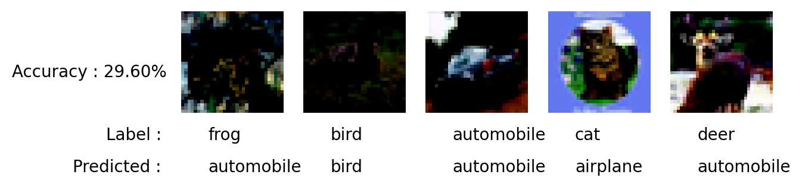

<div class='page'>

### b) Perform hyperparameter search.

I used same method, grid search.  
```python
lr_list = [0.0001, 0.001, 0.01, 0.1]
gamma_list = [0.1, 1.0, 10, 20]
epoch_list = [5, 10, 20, 50, 100]
```
Here, the results were these. (Took about 282 minutes...)
  
Maximum accuracy, and minimum loss were at this same point; accuracy 41%, learning rate=0.0001, gamma=20, epoch=100, with loss 1.79798...  

Another combinations which got more than 40% accuracy were these;
```py
array([[  0.0001  ,  10.      ,  10.      ,   0.4016  ,   1.837483],
       [  0.0001  ,  10.      ,  20.      ,   0.4036  ,   1.833817],
       [  0.0001  ,  10.      ,  50.      ,   0.409   ,   1.834993],
       [  0.0001  ,  20.      ,  10.      ,   0.4026  ,   1.801319],
       [  0.0001  ,  20.      ,  20.      ,   0.4044  ,   1.800351],
       [  0.0001  ,  20.      ,  50.      ,   0.4034  ,   1.798294],
       [  0.0001  ,  20.      , 100.      ,   0.41    ,   1.797985]])
```
This time I will choose best hyperparameters as lr=0.0001, gamma=20, epoch=100. But it takes so long time. So if we have little time, I will choose the alteratives among them.

<div class='page'>

### c) What is the final __test__  accuracy?  

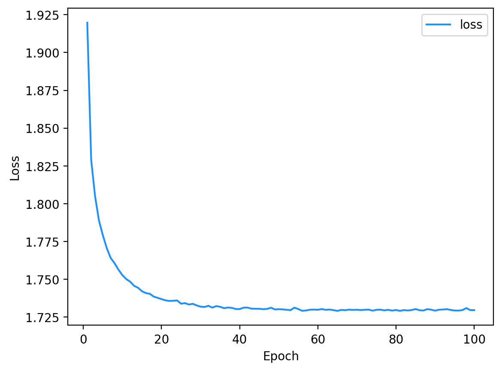

```
Accuracy for class: airplane   is 48.90% (489/1000)
Accuracy for class: automobile is 50.60% (506/1000)
Accuracy for class: bird       is 33.40% (334/1000)
Accuracy for class: cat        is 25.10% (251/1000)
Accuracy for class: deer       is 22.30% (223/1000)
Accuracy for class: dog        is 34.00% (340/1000)
Accuracy for class: frog       is 49.80% (498/1000)
Accuracy for class: horse      is 45.20% (452/1000)
Accuracy for class: ship       is 53.30% (533/1000)
Accuracy for class: truck      is 48.90% (489/1000)

Total Accuracy : 41.15% (4115/10000)
```

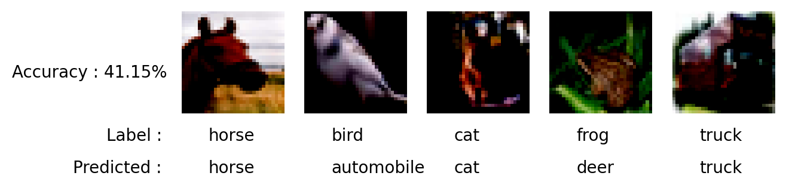