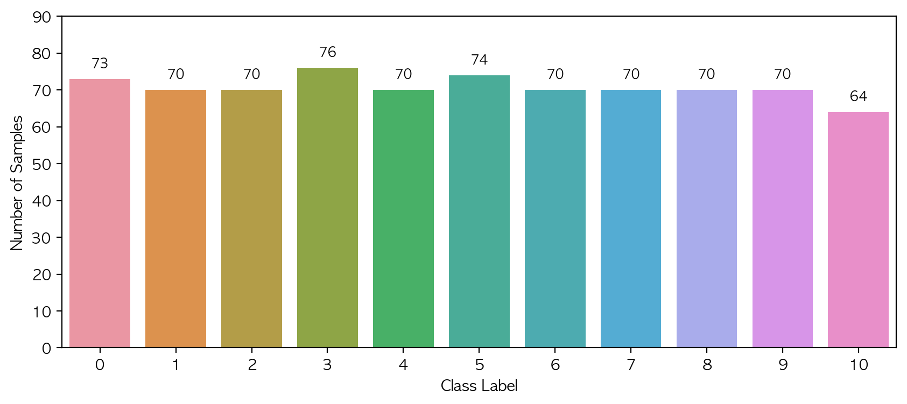
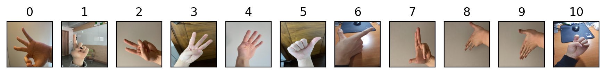
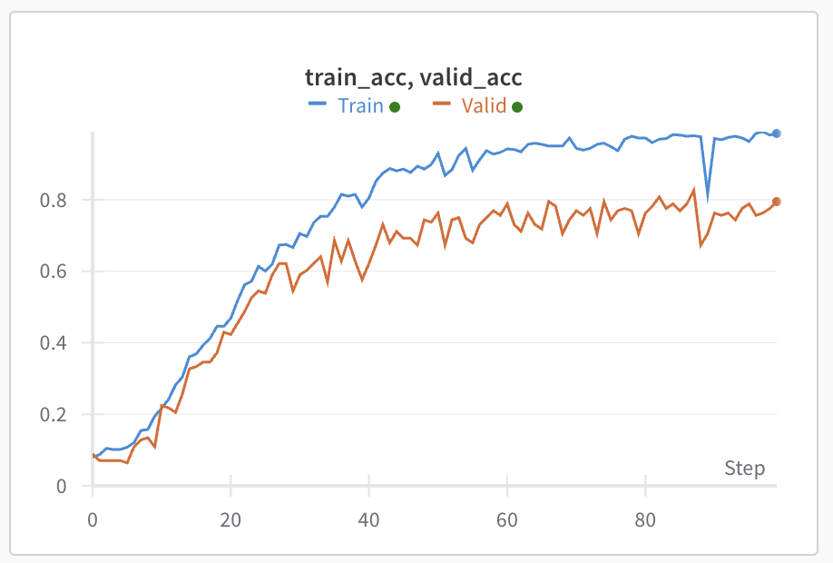
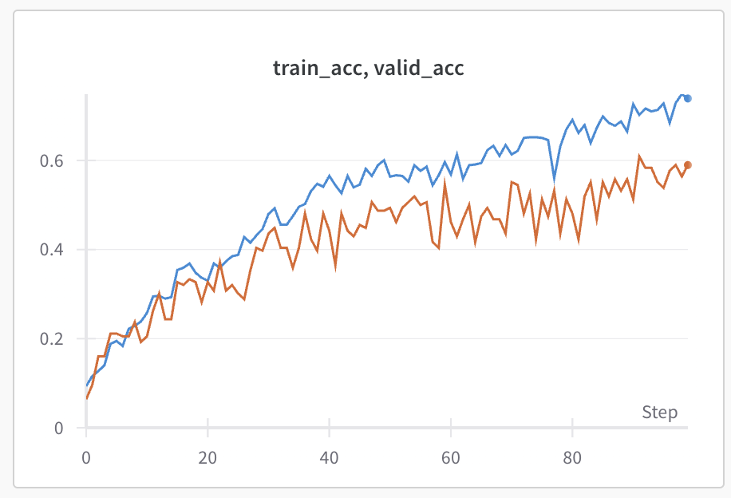

# SOI1010 Machine Learning II - Assignment #3
2022094093 Kim Dohoon, Dept. of Data Science
## Kaggle competition: Sign Language Recognition  

Your task is to achieve as high performance as possible (without cheating, of course). You can use any model you want. But, I suggest that you start with MLP and Convolutional Neural Networks (CNN). I strongly encourage you to research and study advanced neural network models and implement them to get better performance.


### 0. Custom Data Loader for given data  
Using ```CustomDataset``` class, inheriting ```torch.utils.data.Dataset``` in __CustomDataLoader.py__, I could load image dataset.
Also for model utils, loop codes for train, valid and predicting testset are in ```model_util.py```


### 1. EDA  
We have 777 data for train, 330 for test data. (which we want to predict)  
Each has handsign image, which indicates the number from 0 to 10.  
  
On average, each label has about 70 images.  
And these are the images.  
  

<div class="page">

Here, main problems are;  
1. Not sufficient data  
   - Cifar10 data (which was our Assignment 2) has 50000 data. MNIST (which was our Assignment 1) has 60000 data. Compared to these data, we can say we have only a few data.  
2. Rotation problem
   - Rotation varies a lot at same label. Data augmentation for this is required.
3. Different colors
   - Even though they indicates the same number, their skin color vaires a lot. In some images, background color is too similar to skin color to be distinguished.  
4. Very noisy background
   - Some image has too noisy backgrounds. When applying edge detection methods like sobel filter, background objects are more clear than hand.

### 2. Planning  
Considering problems I mentioned before, I planned like this.

1. Can we really train model to focus only on hand region?
   1. If available I wanted to use YOLO (But impossible, since pretrained weights are inhibited)
   2. Manual algorithm is also impossible. Because background is too complex for several data, edge detection methods, such as Sobel filter and Canny filter, finds edges more on background objects.
   3. SO, our model needs to be deep.
2. Is there noise we can reduce?
   1. In our dataset, background is the noise itself. Gaussian blur cannot reduce the noise, becuase they(backgrounds) are so clear.
   2. SO, normalization is used to make them same distribution. And acutally it's almost impossible to remove the noise. Instead, sharnpening method is used to focus more on hand. 

### 3. Model Selection  
What structure is best for our dataset? 
For this problem, I chose two models; GoogLeNet, and VisionTransformer. The reanson I chose them is these.  

**GoogLeNet**
- Deep model requires so many parameters, and this is memory inefficient. 1x1 convolution reduces this problem, and is helpful to train model.
- GoogLeNet uses different kinds of filters. Since image has very different features even in the same class, I thought different feature extraction method is useful.  
- "Going Deeper with Convolutions" (https://arxiv.org/abs/1409.4842)  

**Vision Transformer**
- Actually this is very experimental trial, because we didn't cover this at class. Just what I learned is that vision transformer is a 'game changer' for computer vision. I just wanted to know the performance of this.
- I referred "An Image is Worth 16x16 Words: Transformers for Image Recognition at Scale" (https://arxiv.org/abs/2010.11929). It was very interesting. And also for issue of small data, "Vision Transformer for Small-Size Datasets" (https://arxiv.org/abs/2112.13492) suggests SPT method. I thought I can implement this method, by applying transforms.FiveCrop(224). 

<div class="page">

### 4. Train Model

- Loss
  - CrossEntropyLoss is used.
- Optimizer
  - Adam Optimizer is used.
- Batch size
  - 16 for GoogLeNet, 1 for ViT (just my limit,,,)
- Train/Valid Split
  - len(train) : len(valid) = 8 : 2
  - Because we have small dataset.
- Epoch
  - 100 used each, and also early stopping method (save best) is used.

Model History - GoogLeNet

  

Model History - Vision Transformer

  

It seems vit is not converged, but because of the time limit,,, I coundn't do additional train.


### 5. Conclusion

- Difference of distributions between train and test was matter. Despite the high valid accuracy, test was different. This says model's generalizability is still low. 
- Compared to other simple model, GoogLeNet and VisionTransformer performs relatively similar at train and valid data. They are complex, but strong enough to achieve "generalizability". 
- It is just my limit, but I could only implement ViT for only 1 batch size. I think one of the problems why Vit was bad is because of this. Next semester or future lecture,,, I want to know more about this.
- During this assignment, I also found the mediapipe library. Pretrained landmark maker performs its role, unbelievably. I wanted to know more about that pretrain method, transfer learning, and the landmark algorithm.
- Deep models require small learning rate. At first I thought 0.001 is enough, but model cound't be trained. After setting lr as 0.0005 ~ 0.0003, it started learning. Alexnet, or other structures can be trained with 0.001 learning rate, but why deep models cannot? I wanted to figure out more about this.